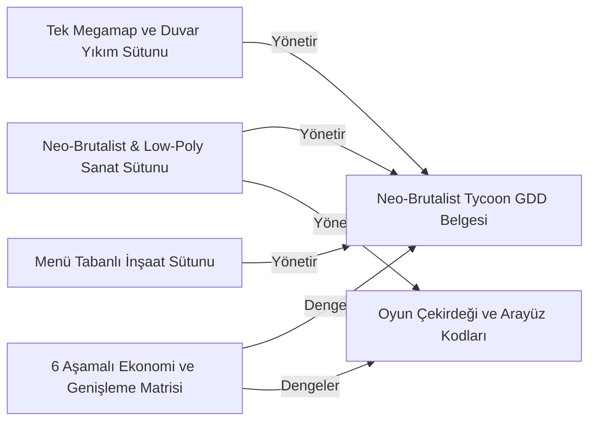

# Neo-Brutalist Arcade Market Tycoon — Ontoloji

Revizyon: 7. Canlı görünüm için `ontology` komutunu çalıştır.

## Türler ve özellikler

### Tasarım Sütunu (`design_pillar`)

- pillar_name: string; zorunlu; seçenekler: None
- description: string; zorunlu; seçenekler: None
- status: string; zorunlu; seçenekler: ['defined', 'implemented']
### Sistem Mimarisi (`system_architecture`)

- subsystem: string; zorunlu; seçenekler: ['player_movement', 'customer_ai', 'build_manager', 'spatial_megamap', 'economy_loop']
- doc_path: file; zorunlu; seçenekler: None
### Ekonomi Denge Matrisi (`economy_matrix`)

- tier_count: integer; zorunlu; seçenekler: None
- validated: boolean; zorunlu; seçenekler: None

## İlişki kuralları

- Yönetir (`governs`): design_pillar → system_architecture; kaynak başına 0..çok, hedef başına 1..çok; etki: none
- Dengeler (`balances`): economy_matrix → system_architecture; kaynak başına 1..çok, hedef başına 1..çok; etki: none

## Somut nesneler

- **Neo-Brutalist & Low-Poly Sanat Sütunu** (`pillar-visual`, design_pillar): {"description": "Ham beton zeminler, asit yeşili ve neon turuncu vurgular, siyah outline çizgileri, sert blok gölgeler", "pillar_name": "Neo-Brutalist & Low-Poly Sanat Tarzı", "status": "defined"}; durum: input; üretici: dış girdi
- **Tek Megamap ve Duvar Yıkım Sütunu** (`pillar-megamap`, design_pillar): {"description": "Bölüm geçişi olmaksızın başlangıç beton dükkanından dışa doğru duvarları yıkarak açılan dinamik parseller", "pillar_name": "Tek ve Büyüyen Megamap", "status": "defined"}; durum: input; üretici: dış girdi
- **Menü Tabanlı İnşaat Sütunu** (`pillar-menu-build`, design_pillar): {"description": "Yerdeki halkalar yerine HUD menüsü üzerinden grid yerleşimi ve endüstriyel vinç kargo kutusu inişi", "pillar_name": "Menü Tabanlı İnşaat ve Vinç İndirme", "status": "defined"}; durum: input; üretici: dış girdi
- **6 Aşamalı Ekonomi ve Genişleme Matrisi** (`econ-balance`, economy_matrix): {"tier_count": 6, "validated": true}; durum: input; üretici: dış girdi
- **Neo-Brutalist Tycoon GDD Belgesi** (`arch-gdd`, system_architecture): {"doc_path": "docs/GDD_NEO_BRUTALIST_TYCOON.md", "subsystem": "spatial_megamap"}; durum: current; üretici: T-GDD-DESIGN
- **Oyun Çekirdeği ve Arayüz Kodları** (`code-core`, system_architecture): {"doc_path": "src/main.js", "subsystem": "player_movement"}; durum: current; üretici: T-CORE-IMPLEMENTATION

## Nesne haritası

Oklar kayıtlı ilişki yönüdür; değişiklik etkisinin yönü üstte ayrıca tanımlıdır.

## Görevlerin veri bağları

- **T-GDD-DESIGN — Neo-Brutalist Megamap Market Tycoon GDD ve Sistem Mimarisini hazırla**: girdiler [pillar-visual, pillar-megamap, pillar-menu-build, econ-balance], çıktılar [arch-gdd], durum done.
- **T-CORE-IMPLEMENTATION — Three.js, Neo-Brutalist HUD ve İnşaat Menüsü çekirdeğini doğrula**: girdiler [pillar-visual, pillar-menu-build, econ-balance], çıktılar [code-core], durum done.

Etki yeniden inceleme ihtiyacıdır; nesnenin yanlış olduğu hükmü değildir.
