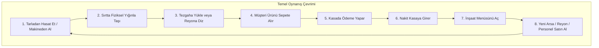

# NEO-BRUTALIST ARCADE MARKET TYCOON — GDD & SİSTEM MİMARİSİ

> **Rol**: Kıdemli Oyun Tasarımcısı & Sistem Mimarı  
> **Konsept**: My Mini Mart tarzı dinamik arcade-idle oynanış döngüsü, ham beton ve neon kontrastlı Neo-Brutalist & Low-Poly görsel kimlik, seviye geçişi olmayan tek bir genişleyen megamap ve yerdeki para pedlerini tamamen kaldıran menü tabanlı endüstriyel inşaat/yerleşim mimarisi.

---

## 1. GÖRSEL SANAT VE STİL REHBERİ (NEO-BRUTALIST & LOW-POLY)

```
+-----------------------------------------------------------------------------------+
|                            GÖRSEL PALET & MATERYAL MİMARİSİ                       |
|                                                                                   |
|  [ Ham Beton Zemin ]       [ Endüstriyel Demir ]       [ Neon Asit Yeşili ]       |
|  #3B3D40 (Pürüzsüz)        #1C1E22 (Sert Metal)        #00FF66 (Kâr / Onay)       |
|                                                                                   |
|  [ Canlı Neon Turuncu ]    [ Elektrik Mavisi ]         [ Siyah Kontur Çizgisi ]   |
|  #FF5500 (Üretim/Alarm)    #00D4FF (Lojistik/Hız)      #0A0A0A (Toon Outline)     |
+-----------------------------------------------------------------------------------+
```

### 1.1. Model ve Yüzey Karakteri
- **Sert Düz Gölgelendirme (Flat Shading)**: Vertex normal yumuşatmaları (smooth normals) tamamen kapatılır. Tüm poligon yüzeyleri (facet'ler) keskin ve belirgindir.
- **Siyah Dış Kontur Çizgileri (Toon Inverted-Hull Outline)**: Tüm mobilyalar, karakterler ve araçlar 2-3px kalınlığında net siyah dış hatlara (#0A0A0A) sahiptir.
- **Mat Malzeme Dokuları**: Işık yansımaları (specular shine) minimumda tutulur; ham gri dökme beton, mat metal saclar, sarı-siyah endüstriyel şeritler ve ham ahşap paletler sahneye hâkimdir.
- **Neon Odak Noktaları**: Ham gri ve antrasit ortamda interaktif öğeler parlak neon renklerle parlar:
  - Üretim makineleri & tarlalar: Canlı Neon Turuncu (`#FF5500`)
  - Satış kasaları & para birimleri: Asit Yeşili (`#00FF66`)
  - Taşıma bantları & lojistik rotaları: Elektrik Mavisi (`#00D4FF`)
- **Brutalist Tipografi**: Arayüzde ve dünya üstü etiketlerde sans-serif, monospaced, büyük harfli (uppercase) ve kalın endüstriyel fontlar kullanılır (ör. *Chakra Petch*, *Space Grotesk*).

---

## 2. TEMEL SİSTEM MİMARİSİ (CORE GAMEPLAY SYSTEMS)



### 2.1. Oyuncu Kontrolleri ve Hareketi
- **Girdi Motoru**: Mobil cihazlar için dokunmatik dinamik sanal joystick (floating virtual joystick), masaüstü için WASD ve Ok tuşları.
- **Kinematik Hareket**: 
  - Maksimum hız: $7.2\text{ m/s}$
  - İvmelenme süresi: $0.15\text{ saniye}$ (tok, seri arcade tepkisi)
  - Dönüş açısı: Hız vektörüne doğru `Slerp` ile yumuşatılmış anlık yönelme ($k_{\text{rot}} = 18\text{ rad/s}$).
- **Çarpışma (Collision)**: 
  - Karakter için 0.45m yarıçaplı dikey kapsül çarpıştırıcı.
  - Reyonlar, duvarlar ve makineler için AABB (Axis-Aligned Bounding Box) veya OBB (Oriented Bounding Box) kutuları.

### 2.2. Fiziksel Sırt Yığını ve Taşıma Mekaniği (Backpack Stack)
- **Dikey Yığın Mimarisi**: Oyuncu ürünleri topladıkça kutular/meyveler karakterin arkasında dikey sütun halinde dizilir.
- **Kapasite Ölçeği**: Başlangıç $4$ slot. İnşaat menüsünden "Sırt Çantası Güçlendirmesi" ile kademeli olarak $6 \rightarrow 10 \rightarrow 16 \rightarrow 24$ adede kadar çıkar.
- **Verlet / Spring-Damper Esneme Fiziği**:
  - Oyuncu koşarken veya aniden yön değiştirirken, sırtındaki kutular bir önceki kutunun pozisyonunu yay katsayısıyla takip eder ($k_{\text{spring}} = 24.0$, $d_{\text{damping}} = 0.65$).
  - Ani duruşlarda kutular hafifçe öne yaylanır; dönüşlerde merkezkaç etkisiyle yana yatar. Bu etki arcade-idle oyunlarının doyum hissini ("juiciness") oluşturur.
- **Vakumlu Parabolik Transfer (Bezier Parabolic Arc)**:
  - Oyuncu bir reyonun veya makine besleme kutusunun etkileşim yarıçapına ($r = 1.8\text{ m}$) girdiğinde:
  - Her $0.07\text{ saniyede}$ bir adet ürün sırt yığınının en üstünden havalanır, havada parabolik bir yay çizerek hedef tezgâha konur.
  - Hedefe konduğu anda kutu $1.2\times$ oranında hafifçe ezilip açılır (squash & stretch animasyonu).

```
[ Sırt Yığını Fiziği ]
      ( Üst Kutu )  -- Gecikmeli yaylanma (Spring Lag)
           |
      ( Orta Kutu )
           |
      ( Alt Kutu )
           |
   [ Oyuncu Karakter ] ===> Hızlı Dönüş ===> Yığın karşı yöne eğilir (Dynamic Lean)
```

### 2.3. Müşteri Yapay Zekası (HFSM & Dinamik NavMesh)

Müşteriler bağımsız düşünen, dükkâna arabayla gelen veya yürüyerek giren, reyonlardan alışveriş yapıp kasada ödeme yapan 8 durumlu Hiyerarşik Durum Makinesi (HFSM) ile çalışır:

```
[ SPAWN ] 
   │
   ▼
[ MAĞAZAYA GİRİŞ & SEPET ALMA ]
   │
   ▼
[ İHTİYAÇ BELİRLEME (1-3 Ürün Seçimi) ]
   │
   ▼
[ REYONA YÜRÜME (NavMesh A*) ]
   │
   ├──▶ Reyon Boş ───▶ [ 8 Sn Sabırsız Bekleme ] ───▶ Ürün Gelmezse Terk Et (Kızgın)
   │
   └──▶ Reyon Dolu ──▶ [ Ürünü Sepete Ekle ]
                            │
                            ▼
                     [ KASAYA YÖNELME & KUYRUK ]
                            │
                            ▼
                     [ ÖDEME YAPMA & PARA FIRLATMA ]
                            │
                            ▼
                     [ MAĞAZADAN AYRILIŞ & DESPAWN ]
```

#### Durum Detayları:
1. **SPAWN**: Otoparktaki rastgele bir araçtan veya yol kenarındaki duraktan haritaya 1 adet müşteri türetilir (Aktif sınır: eşzamanlı maksimum 24 müşteri).
2. **ENTER_MART**: Giriş kapısındaki turnikelerden geçer, giriş sepeti rafından bir tekerlekli araba/sepet kapar.
3. **SELECT_GOAL**: O an mağazada kilidi açık olan ürünlerden rastgele 1 ila 3 ürün listesi oluşturur (Örnek: `2 Domates`, `1 Salça`). Ürün simgesi müşterinin başı üstünde neon konuşma balonunda piktogram olarak görünür.
4. **NAV_TO_SHELF**: Haritanın 2B navigasyon ızgarası üzerinde A* algoritmasıyla en yakın ilgili reyona yürür.
5. **PICK_ITEM**:
   - Reyon doluysa: Ürün reyondan müşterinin sepetine pıt sesiyle zıplar.
   - Reyon boşsa: Müşteri reyon önünde ayağını yere vurarak $8\text{ saniye}$ bekler (başının üstünde kırmızı bir geri sayım halkası dolar). Süre biterse alışverişi iptal edip hışımla çıkar; süre bitmeden oyuncu veya personel rafı doldurursa ürünü alır.
6. **QUEUE_AT_REGISTER**: Tüm ürünlerini toplayınca aktif kasaya yönelir. Kasadaki sıranın sonuna geçer (öndeki müşteriden $0.9\text{ m}$ mesafe korur).
7. **PAYMENT**: Sıra kendisine gelince sepeti tezgâha koyar. Kasiyer veya oyuncu kasanın arkasında durduğu anda ürünler barkod okuyucudan geçer (bip sesi) ve kasanın yanındaki banknot masasına yeşil parlak dolar desteleri saçılır.
8. **EXIT_STORE**: Dükkândan elinde poşetiyle çıkarak otoparkta kaybolur (Despawn).

#### Dinamik NavMesh Güncellemesi (Obstacle Carving & Tile Stitching):
- Mağaza zemini $0.5\text{ m} \times 0.5\text{ m}$ hücrelerden oluşan dinamik bir NavMesh grafiğidir.
- Oyuncu İnşaat Menüsünden yeni bir reyon yerleştirdiğinde, ilgili hücreler anında `WALKABLE = false` yapılır ve çevre hücrelerin komşulukları güncellenir.
- Yeni bir parsel satın alınıp duvar yıkıldığında, yeni odanın hücreleri anında ana haritanın ızgarasına dikişsizce eklenir (Stitching). Yürüyüş yollarında hiçbir kesinti yaşanmaz.

---

## 3. İNŞAAT MENÜSÜ VE YERLEŞİM SİSTEMİ UX AKIŞI

> **Kritik Tasarım Kuralı**: Zemin üzerinde duran para çemberleri (floor pads) **tamamen kaldırılmıştır**. Tüm genişlemeler ve satın alımlar oyuncunun kontrolündeki endüstriyel arayüz üzerinden yapılır.

```
+---------------------------------------------------------------------------------------------------+
| [X] İNŞAAT & YÖNETİM MERKEZİ                                                     Bakiye: $1,450   |
+---------------------------------------------------------------------------------------------------+
|  [REYONLAR]   [ÜRETİM MAKİNELERİ]   [KASA & LOJİSTİK]   [PERSONEL]   [ARSA GENİŞLETME]            |
+---------------------------------------------------------------------------------------------------+
|  +-----------------------+  +-----------------------+  +-----------------------+                  |
|  | [3D İKON]             |  | [3D İKON]             |  | [3D İKON]             |                  |
|  | Domates Reyonu (Çift) |  | Salça Kazanı (Buhar)  |  | Otomatik Kasa Masası  |                  |
|  | Kapasite: 24 Kutu     |  | Üretim: 2 Dom -> 1 Sal|  | İşlem Hızı: 1.5 sn    |                  |
|  | Maliyet: $180         |  | Maliyet: $350         |  | Maliyet: $500         |                  |
|  | [SATIN AL & YERLEŞTİR]|  | [SATIN AL & YERLEŞTİR]|  | [SATIN AL & YERLEŞTİR]|                  |
|  +-----------------------+  +-----------------------+  +-----------------------+                  |
+---------------------------------------------------------------------------------------------------+
```

### 3.1. Adım Adım UX ve Yerleşim Akışı

```
[1. BUTONA BAS] ────────▶ [2. TAKTİK KAMERA] ──────▶ [3. SEÇİM & HAYALET MODEL]
Ekran sağ altındaki         Kamera yukarı çekilir,       Menüden birim seçilir.
neon çizgili "İNŞAAT"        zemin neon grid ızgarası     İmleç altında yeşil yarı
butonuna dokunulur.         ile kaplanır.                saydam hayalet model doğar.
                                                                     │
                                                                     ▼
[6. VİNÇ İNİŞ ANİMASYONU] ◀── [5. ONAYLA DÜĞMESİ] ◀── [4. IZGARAYA KİLİTLENME & KONTROL]
Gökyüzünden endüstriyel      Kullanıcı yeşil onay        Model 0.5m grid basamağında kayar.
kargo sandığı dumanla iner,  butonuna basar, para        Kesişme yoksa: YEŞİL (Geçerli)
patlayarak birim açılır.    kasadan düşer.              Kesişme/Yol tıkama: KIRMIZI (Geçersiz)
```

1. **İnşaat Modunu Açma**:
   - Oyuncu ekranın sağ alt köşesindeki sarı-siyah emniyet şeritli **"İNŞAAT / DÜZENLE"** FAB butonuna basar.
   - Oyun dünyasındaki karakter hareketleri askıya alınır.
   - Kamera açısı $45^\circ$'den $70^\circ$ dik izometrik taktik görünüme yumuşakça yükselir (`GSAP cubic-bezier`).
   - Zemin üzerinde 0.5 metrelik neon ızgara çizgileri (Blueprint Grid Overlay) belirir.

2. **Katalogdan Seçim**:
   - 5 kategori sekmesi arasından istenen birim seçilir: Reyonlar, Üretim Makineleri, Kasa/Lojistik, Personel, Arsa Parselleri.
   - Yetersiz bakiye durumunda kartlar soluklaşır ve üzerinde kırmızı neon asma kilit belirir.

3. **Hayalet Yerleşim Modeli (Ghost Blueprint)**:
   - Seçilen birimin yarı saydam neon yeşil hayalet modeli (Ghost Mesh) ekranda parmağın/fare imlecinin altında belirir.
   - Model zemindeki $0.5\text{ m}$ ızgara karelerine manyetik olarak kilitlenir (Snapping).
   - Ekranda modelin hemen yanında iki yüzen buton açılır: **[⟳ Döndür 90°]** ve **[✓ Onayla]**.

4. **Geçerlilik ve Çarpışma Doğrulaması**:
   - Modelin kapladığı ayak izi (Footprint) kontrol edilir.
   - **KIRMIZI (Geçersiz)**: Başka bir reyonla çakışıyorsa, duvara giriyorsa veya dükkân ana koridorunu tamamen kapatıp minimum $1.2\text{ m}$ yürüyüş payı bırakmıyorsa model kırmızı yanıp söner ve onay butonu kilitlenir.
   - **YEŞİL (Geçerli)**: Konumlandırma nizami ise onay butonu aktifleşir.

5. **Endüstriyel Vinç & Kargo Kutusu İniş Sekansı (The Crate Drop)**:
   - Onay butonuna basıldığı an bakiye düşer (`-$250` neon text patlaması).
   - Taktik menü kapanır ve kamera eski açısına dönerken gökyüzünden sarı endüstriyel kargo konteyneri hedef noktaya büyük bir ivmeyle düşer.
   - Yere vurduğunda ($t=0.35\text{s}$):
     - Kamera mikro sarsıntısı (Screen Shake: $0.15\text{s}$, $2\text{px}$).
     - Low-poly duman ve kıvılcım partikülleri fırlar.
     - Tok bir endüstriyel hidrolik çarpma sesi ("THUD-CLANG") duyulur.
   - Konteyner kapağı menteşelerinden açılarak yere yatar ve içinden yepyeni reyon yükselir.
   - NavMesh anında güncellenir ve reyon kullanıma hazır hale gelir.

---

## 4. GENİŞLEME VE EKONOMİ DENGE PLANI (6 KADEMELİ MEGAMAP MATRİSİ)

Tüm oyun, sahne geçişi olmadan tek bir arsa üzerinde geçer. Başlangıçta sadece **Parsel A0** açıktır. Diğer parseller inşaat menüsünden satın alındığında beton bariyerler/tuğla duvarlar endüstriyel bir yıkım balyozu efektiyle parçalanarak yeni alana kesintisiz yürüyüş yolu açılır.

### 4.1. Parseller, Üretim Hatları ve Denge Tablosu

| Kademe | Parsel Adı & Konumu | Açılan Binalar & Hatlar | Giriş / Çıkış Reçetesi | Süre (sn) | Birim Maliyet | Satış Fiyatı | Net Kâr Marjı | Otomasyon / Personel | Parsel Açma Bedeli |
| :---: | :--- | :--- | :--- | :---: | :---: | :---: | :---: | :--- | :---: |
| **T1** | **Parsel A0**<br>*(Merkez Market)* | • Domates Tarlası #1<br>• Temel Sebze Reyonu<br>• Manuel Kasa Tezgâhı | 1 Tohum → 1 Domates | 2.5 sn | $0 | $6 | $6 (Net) | Oyuncu kendisi taşır ve kasaya bakar | **$0**<br>*(Başlangıç)* |
| **T2** | **Parsel A1**<br>*(Doğu Kanadı)* | • Salça Buhar Kazanı<br>• Salça & Konserve Reyonu<br>• Otomatik Kasiyer Masası | 2 Domates → 1 Salça | 3.5 sn | $12 (Girdi) | $28 | +$16 / adet | **Kasiyer #1**<br>(Kasada durur, oyuncuyu serbest bırakır) | **$350** |
| **T3** | **Parsel B1**<br>*(Kuzey Tarım)* | • Mısır Tarlası<br>• Buğday Tarlası<br>• Patlamış Mısır Arabası<br>• Un Değirmeni | 1 Mısır → 1 Popcorn<br>2 Buğday → 1 Un Torbası | 3.0 sn<br>4.0 sn | $0<br>$0 | $18<br>$24 | +$18<br>+$24 | **Bahçıvan #1**<br>(Tarlaları otomatik hasat eder) | **$1,200** |
| **T4** | **Parsel B2**<br>*(Kuzeydoğu Atölye)* | • Taş Fırın Ünitesi<br>• Ekmek Reyonu<br>• Portakal Bahçesi & Sıkıcı | 1 Un + 1 Su → 1 Somun Ekmek<br>2 Portakal → 1 Meyve Suyu | 4.5 sn<br>3.0 sn | $24<br>$0 | $55<br>$32 | +$31<br>+$32 | **Reyon Görevlisi #1**<br>(Tezgâhlardan reyonlara mal taşır) | **$3,800** |
| **T5** | **Parsel C1**<br>*(Batı Hayvancılık)* | • Tavuk Kümesi (Yumurta)<br>• Süt Çiftliği (İnek/Süt)<br>• Şarküteri Soğuk Dolabı | 1 Mısır → 2 Yumurta<br>1 Saman → 1 Şişe Süt | 5.0 sn<br>6.0 sn | $9<br>$15 | $40<br>$65 | +$31<br>+$50 | **Depocu & Forklift**<br>(Ağır paletleri ara depoya taşır) | **$9,500** |
| **T6** | **Parsel C2 & D1**<br>*(Güney Restoran)* | • Burger & Pizza Mutfağı<br>• Müşteri Yemek Masaları<br>• Dış Lojistik Kargo Rampası | 1 Ekmek + 1 Domates + 1 Et → Burger<br>1 Un + 1 Peynir + 1 Domates → Pizza | 7.0 sn<br>8.0 sn | $65<br>$80 | $180<br>$240 | +$115<br>+$160 | **Restoran Şefi & Garson**<br>(Müşterilere masada servis yapar) | **$25,000** |

---

## 5. DUVAR YIKIMI VE MEGAMAP GENİŞLEME MEKANİĞİ

Tek harita prensibinde her parsel, komşu parselle aralarında endüstriyel beton duvarlar ve sarı kordon bariyerlerle ayrılmış durumdadır:

1. **Kilitli Alan Görünümü**:
   - Kilitli parselin üzerinde yarı saydam bir endüstriyel branda veya inşaat iskeleleri yer alır.
   - Duvarın üstünde büyük endüstriyel neon tabela parlar: `PARSEL B1 // SATIN ALINABİLİR: $1,200`.
2. **Satın Alma Tetiklenmesi**:
   - Oyuncu İnşaat Menüsünden "Arsa Genişletme -> Parsel B1" satın aldığında:
   - Kamera parsel sınırına yumuşak bir sinematik kaydırma yapar ($1.2\text{ sn}$).
   - Aradaki beton duvar üzerine sarı-siyah dinamik çarpı işaretleri yansıtılır.
   - Büyük bir hidrolik yıkım çekici duvara çarpar; duvar blokları low-poly parçacıklara ayrılarak tozar ve zemine gömülür.
3. **Sorunsuz Entegrasyon (Seamless Transition)**:
   - Yeni parselin beton zemini mevcut market zeminiyle kusursuzca kaynaşır.
   - Zemin kaplaması, aydınlatma ve gölgelendirme ana sahneye dahil olur.
   - NavMesh haritası yeni alanın poligonlarıyla dikilir ve müşteriler hiçbir yükleme ekranı görmeden yeni koridorlara akmaya başlar.

---

## 6. SİSTEM MİMARİSİ VE TEKNİK UYGULAMA REHBERİ

```
c:/Users/YSR_MONSTER/.antigravity/Market/
├── .project/                  # Orvant v0.3 Ontoloji ve Görev Durum Motoru
├── src/
│   ├── core/                  # WebGL Döngüsü, Taktik Kamera, Input Yöneticisi
│   ├── domain/                # Ekonomi, Reçeteler, Sırt Çantası Mantığı, HFSM
│   │   ├── catalog.js         # Ürün, Reçete ve Fiyat Tanımları
│   │   ├── backpack.js        # Dikey Yığın ve Verlet Esneme Fiziği
│   │   ├── navigation.js      # 2B Dinamik NavMesh & A* Algoritması
│   │   └── customerHFSM.js    # Müşteri Durum Makinesi
│   ├── presentation/          # Three.js 3D Sahnesi, Toon Shader & Low-Poly Modeller
│   │   ├── WorldScene.js      # Tek Megamap, Aydınlatma, Parseller
│   │   ├── DropCrate.js       # Vinç & Kargo Kutusu İniş Animasyon Motoru
│   │   └── ToonMaterial.js    # Neo-Brutalist Kontur ve Flat Shading Materyalleri
│   ├── ui/                    # DOM/Canvas Hibrit İnşaat ve Düzenleme Menüsü
│   │   ├── BuildMenu.js       # Sekmeli İnşaat Kataloğu ve Grid Raycast
│   │   └── HUD.js             # Neon Bakiye, Hedef Çubuğu ve Bildirimler
│   └── main.js                # Uygulama Başlangıç Noktası
├── docs/                      # GDD ve Sistem Mimarisi Belgesi
└── package.json               # Three.js, GSAP, Vite
```

Bu mimariyle oyun, *My Mini Mart*'ın bağımlılık yapan döngüsünü modern ve sofistike bir Neo-Brutalist sanat tarzıyla buluştururken, yerdeki basit halkalar yerine stratejik bir menü tabanlı tycoon derinliği sunar.
